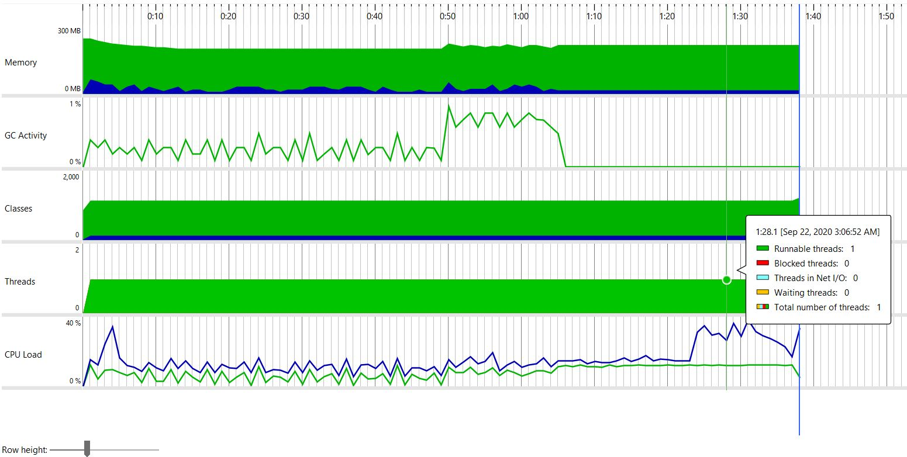
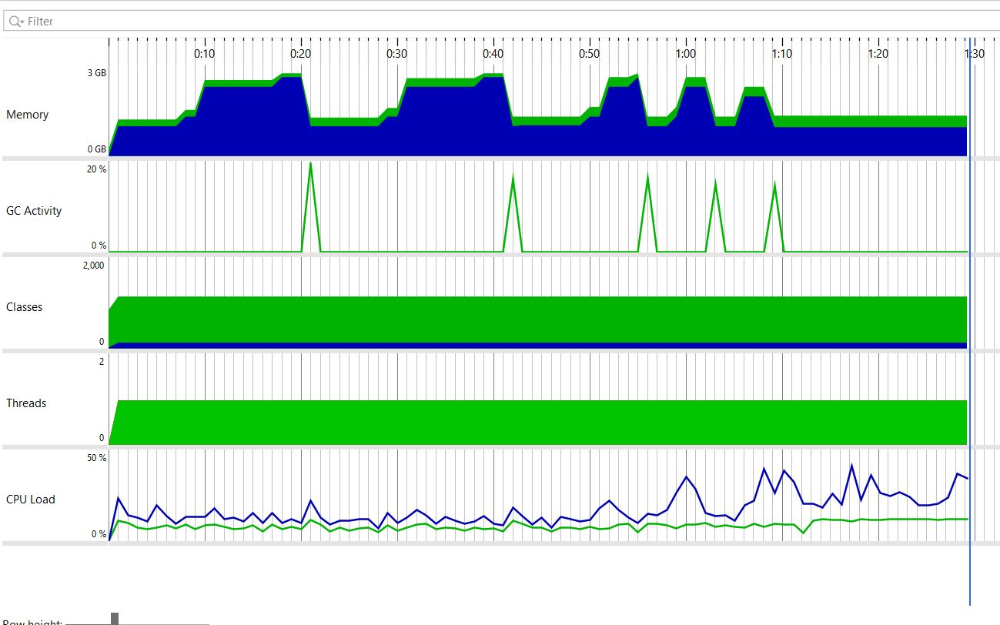

# Qumulo

### [Documenataion](https://jeetmpatel1.github.io/Qumulo/)
### Requirements
-  JDK v8
-  maven v3.6.3
-  Intellij (preferred)  - Just to analyse code.

### How To Run the Project

1.  Clone the source code ( You can find out source code as zip from email)
2.  check java version by ```java --version```. It should be ```v1.8``` or greater.
3.  check maven version by ```mvn --version```. it should be ```v3.6.3``` or greater.
3.  build the project by ```mvn clean test``` 
4.  Three test should get executed and get passed. 
5.  Now you can import it in Intellij and analyse and evaluate.
6.  Once we are done with evaluation, i will start working on packaging the application for my personal usage. 

### Features
-   **Adaptable Program** 
    -   **Number of Files**
        In Future if team scales to 10 employees and they want to give one file to each employee, then set the value of ```public static final int NUMBER_OF_OUTPUT_FILES = 5;``` in ```SolutionConfig```
    -   **Handling large files**
    This program is capable of handling very large files in GBs without throwing ```OutOfHeapMemory```.  With Default value set to ```1024000``` and JVM Heap size of ```256Mb```, it is not throwing any error for JVM Heap for files of size ```10GB```. I haven't tested it for larger file sizes. For any value higher than ```10GB``` if you're getting any error,
        - Try to change ```public static final int BYTES_TO_READ_AT_A_TIME = 1024000;``` in  ```SolutionConfig``` to some higher value. It should not throw ```OutOfHeapMemory``` now. 
        - If setting ```public static final int BYTES_TO_READ_AT_A_TIME = 1024000;``` in  ```SolutionConfig``` to maximum possible value doesn't help, you can always increase JVM Heap Size by setting up ```-Xmx``` for JAVA Process.
    
    -   **Tricky File names**
        -   If your file name contains ```_``` which is used as separator, just change ```public static final String OUTPUT_FILE_SPLITTER = "_";``` in ```SolutionConfig```with some character which doesn't appear in filename.
        -   If you want to change output filename, change ```public static final String FINAL_OUTPUT_FILE_NAME = OUTPUT_FILE_SPLITTER + "output";``` in ```SolutionConfig```.

### Restriction on Hackerrank to write Solution has impected on two problems
-   Showing a **Maintainable code** in One Single file is tough  from my perspective. Still i have tried to make all logical segreggations in different classes. Hope that helps.  If you want properly maintainable code, source code in my email is seggregated in different files with proper packages structure. We can discuss how to improve it more. 
-   Solution to this problem can be thought in different way too. Writing metedata within the part file. It can help with Faster processing. But pros and cons can be discussed. 


### Performance measure
-   **File Size :** ```6603149KB ( 6GB )```
    **Time Taken :** 97 seconds
    **Parameters :** Default 
    **JPS File :** ![Download JPS]./performance_data/97s.jps)
    
    **Image :** 
    

-   **File Size :** ```6603149KB ( 6GB )```
    **Time Taken :** 89 seconds
    **Parameters :** increased  ```public static final int BYTES_TO_READ_AT_A_TIME = 1024000;``` to maximum possible value ( Integer.MAX_VALUE )
    **JPS File :** 
    
    **Image :** 
    
